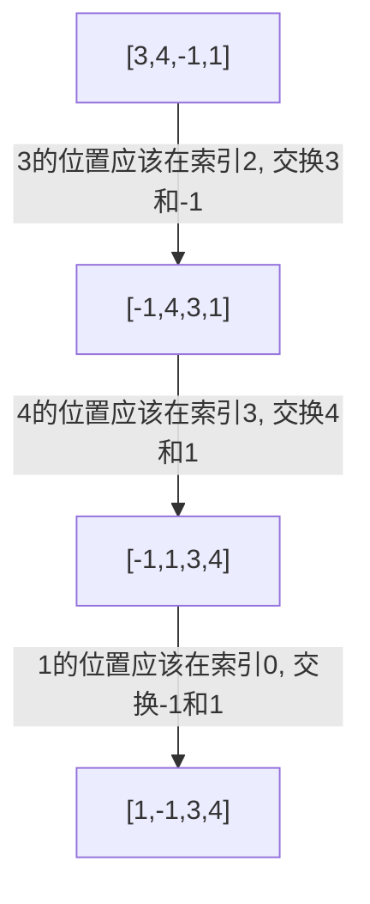

\section{题目}

给你一个未排序的整数数组 `nums`, 请你找出其中没有出现的最小的正整数.
请你实现时间复杂度为 $O(N)$ 并且只使用常数级别额外空间的解决方案.

\textbf{示例 1}: 

```
输入: nums = [1,2,0]
输出: 3
```

\textbf{示例 2}: 

```
输入: nums = [3,4,-1,1]
输出: 2
```

\textbf{示例 3}: 

```
输入: nums = [7,8,9,11,12]
输出: 1
```

**提示**: 

- $1 <= nums.length <= 5 * 10^5$
- $-2^{31} <= nums[i] <= 2^{31} - 1$

### 解法

#### 解法一

最简单的做法就是遍历数组, 然后将遍历到的数放入集合(`HashSet`)中,

随后从 1 开始枚举正整数, 然后判断正整数是否在集合中.

让我们来写代码

```java
class Solution {
    // 数组长度为 N
    public int firstMissingPositive(int[] nums) {
        // 实例化一个集合: O(1)
        var set = new HashSet<Integer>();

        // 整个 for 循环: O(N)
        for (var num : nums) {
            // 将 num 添加到集合: 近似 O(1)
            set.add(num);
        }

        // 从 1 开始枚举正整数
        // 要注意: 未出现的正整数一定在范围 (1, N+1) 之间
        // 用反证法可以证明这一点
        int count = 1; // O(1)
        // 最多是 O(N)
        while (set.contains(count)) {
            // O(1)
            count++;
        }

        // O(1)
        return count;
    }
}
```

让我们来分析一下程序的性能.

- 时间复杂度: 在程序的注释中, 我们写了每个语句大致的时间开销. 累加下来, 时间复杂度大概是: $3 \times O(1) + 2 \times O(N) \approx O(N)$.
- 空间复杂度: 我们使用了一个 `HashSet`, 所以空间复杂度大致是 $O(N)$.

这段代码可以 AC, 但是可以看出空间复杂度不太符合要求, 题目要求我们的空间复杂度是常数.

#### 解法二: 置换法

我们需要将数组里的数据挪到数组中正确的位置. 也就是将 `x` 挪到索引为 `x-1` 的数组位置. 例如, 将 `3` 移动到数组索引为 `2` 的位置.

这里举一个例子:



然后找出来的最小正整数就是 `2` 了.

当然我们需要将示意图转换成代码, 这里我们需要思考如何来交换元素?

从左到右遍历数组, 分情况讨论:

1. 如果遍历到的元素 `nums[i]` 小于等于 `0`, 那么直接跳过.
2. 如果遍历到的元素 `nums[i]` 大于 `N+1`, 那么直接跳过.
3. 如果 `nums[i] == nums[nums[i] - 1]`, 那么说明 `nums[i]` 已经位于正确的位置. 那么直接跳过.
4. 如果 `nums[i] != nums[nums[i] - 1]`, 那么将 `nums[i]` 和 `nums[nums[i] - 1]` 交换. 那么交换以后, 索引 `nums[i] - 1` 的元素已经位于正确的位置. 但此时索引 `i` 的元素不一定已经处于正确的位置了. 所以可能需要继续和其它元素交换. 一直交换到满足条件 1, 2, 3 为止.

写代码:

```java
class Solution {
    public int firstMissingPositive(int[] nums) {
        int N = nums.length;

        for (int i = 0; i < N; i++) {
            while (
                nums[i] > 0 &&               // 条件1
                nums[i] < N + 1 &&           // 条件2
                nums[i] != nums[nums[i] - 1] // 条件3
            ) {
                int j = nums[i] - 1;
                int tmp = nums[i];
                nums[i] = nums[j];
                nums[j] = tmp;
            }
        }

        for (int i = 0; i < N; i++) {
            if (nums[i] != i + 1) {
                return i + 1;
            }
        }

        return N + 1;
    }
}
```

由于每次的交换操作都会使得某一个数交换到正确的位置, 因此交换的次数最多为 $N$, 整个方法的时间复杂度为 $O(N)$.

我们在数组进行的操作是原地交换, 所以只需要借助一些局部变量, 所以空间复杂度为 $O(1)$.